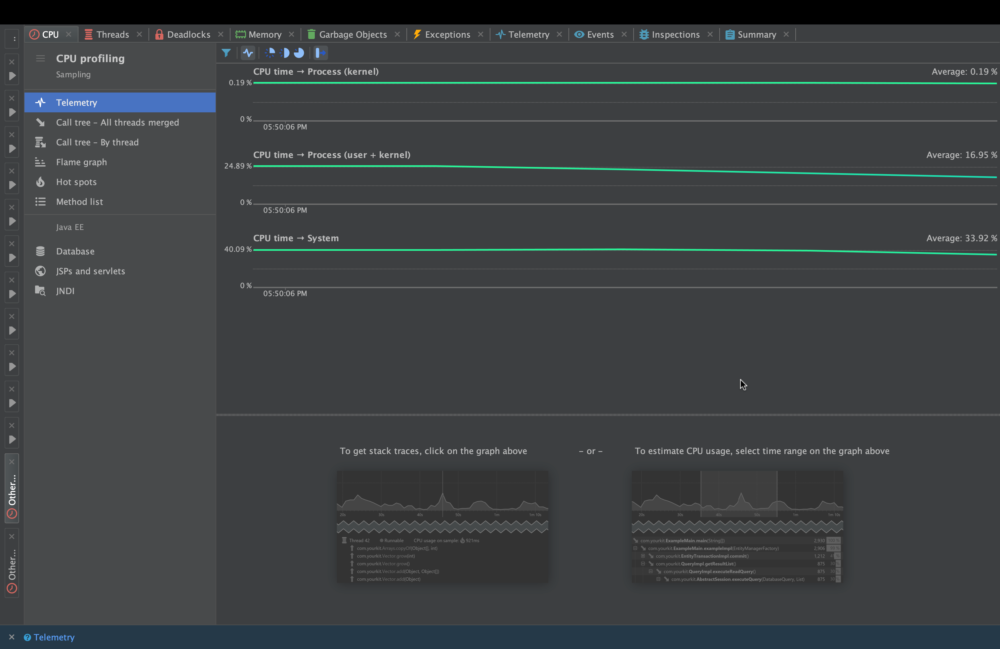

# آزمایش پنجم (پروفایلینگ)

# ....
.....

# بخش دوم:‌پیاده‌سازی یک الگوریتم جدید و پروفایل آن
در این بخش باید یک الگوریتم دلخواه‌(بجز sort و fibbonaci) پیاده سازی کرده و آنرا پروفایل کنیم و سپس با توجه به مصرف منابع، آنرا به نوعی optimize کنیم تا بهبود یابد. در این قسمت، ما عملیات __ضرب دوتا ماتریس مربعی__ را پیاده‌سازی می‌کنیم و آنرا پروفایل می‌کنیم. 

در ابتدا پیاده‌سازی ما بصورت ضرب ماتریسی ساده‌است (هر سطر در هر ستون ضرب می‌شوند تا المان متناظر را در جواب بدست بیاوریم). کد آن بصورت زیر است:


```java
public class OtherAlgorithm {

    public static void main(String[] args) {
        int size = 1024; // Size of the matrices
        double[][] matrixA = generateMatrix(size);
        double[][] matrixB = generateMatrix(size);
        double[][] result = multiplyMatrices(matrixA, matrixB, size);

        System.out.println("Matrix multiplication completed.");
    }

    private static double[][] generateMatrix(int size) {
        double[][] matrix = new double[size][size];
        for (int i = 0; i < size; i++) {
            for (int j = 0; j < size; j++) {
                matrix[i][j] = Math.random();
            }
        }
        return matrix;
    }

    private static double[][] multiplyMatrices(double[][] matrixA, double[][] matrixB, int size) {
        double[][] result = new double[size][size];
        for (int i = 0; i < size; i++) {
            for (int j = 0; j < size; j++) {
                for (int k = 0; k < size; k++) {
                    result[i][j] += matrixA[i][k] * matrixB[k][j];
                }
            }
        }
        return result;
    }
}
```

همانطور که می‌بینید، در ابندا دو تا ماتریس random با سایز داده شده (در اینجا ۱۰۲۴) می‌سازیم و سپس آنها را با یک for ساده روی سطرها و ستون‌ها، ضرب می‌کنیم. عملیات profiling با YourKit بصورت زیر خروجی می‌دهد:


همانطور که می‌بینید، مصرف cpu (همان cpu own time) و بصرت کلی cpu time در متد `multiplyMatrices` بسیار زیاد است (۴۱۰۸ میلی ثانیه). همچنین در قسمت Hot Spots پروفایلینگ نیز این موضوع مشهود است:


و همچنین call tree را می‌توانیم بصورت زیر ببینیم:




همانطور که در تمامی این موارد مشهود است، بیشترین مصرف منابع cpu بخاطر نحوه‌ی پیاده‌سازی ضرب ماتریسی است و در `multiplyMatrices` اتفاق می‌افتد. برای بهبود این اتفاق، نحوه‌ی ضرب را تغییر می‌دهیم و از روش __Block matrix multiplication__ استفاده می‌کنیم. در این روش، هر ضرب ماتریسی به ضرب تعدادی بلاک کوچکتر شکسته می‌شود. پیاده‌سازی آن بصورت زیر است:
  
```java
public class OtherAlgorithm {

    public static void main(String[] args) {
        int size = 1024; // Size of the matrices
        double[][] matrixA = generateMatrix(size);
        double[][] matrixB = generateMatrix(size);
        double[][] result = multiplyMatrices(matrixA, matrixB, size);

        System.out.println("Matrix multiplication completed.");
    }

    private static double[][] generateMatrix(int size) {
        double[][] matrix = new double[size][size];
        for (int i = 0; i < size; i++) {
            for (int j = 0; j < size; j++) {
                matrix[i][j] = Math.random();
            }
        }
        return matrix;
    }

    private static double[][] multiplyMatrices(double[][] matrixA, double[][] matrixB, int size) {
        double[][] result = new double[size][size];
        int blockSize = 64;

        for (int i = 0; i < size; i += blockSize) {
            for (int j = 0; j < size; j += blockSize) {
                for (int k = 0; k < size; k += blockSize) {
                    for (int ii = i; ii < Math.min(i + blockSize, size); ii++) {
                        for (int jj = j; jj < Math.min(j + blockSize, size); jj++) {
                            for (int kk = k; kk < Math.min(k + blockSize, size); kk++) {
                                result[ii][jj] += matrixA[ii][kk] * matrixB[kk][jj];
                            }
                        }
                    }
                }
            }
        }
        return result;
    }
}
```
با پیاده‌سازی این روش، نه تنها از برخی محاسبات مجدد (آنهایی که یک بلاک در آنها تکرار می‌شود) جلوگیری می‌شود بلکه از cache locality نیز بهره برده می‌شود. این موضوع در نتیجه‌ی پروفایلینگ نیز مشهود است:


می‌بینید که زمان اجرای متد `main` به ۸۸۸ میلی‌ثانیه کاهش یافته که این یعنی زمان اجرا و میزان استفاده از cpu به شدت کمتر شده است (از اردر ۴۰۰۰ میلی‌ثانیه به ۸۸۸ میلی‌ثانیه). این موضوع را (و بهبود استفاده از منابع را) با پروفایلر Intellij نیز نشان می‌دهیم:


(بالا، حالت اول و optimize نشده است. پایین، حالت دوم و optimize شده است)


می‌بینید که استفاده از منابع (علاوه بر زمان درگیری منابع) نیز کم شده است. این موضوع نشان می‌دهد که optimization ما هدف مورد نظر ما را به خوبی انجام داده است. همچنین به خروجی ‌های زیر از Yourkit نیز توجه کنید (برای حالت optimize شده):


ضمنا میزان استفاده از heap memory نیز به مقدار کمی optimize شده است که می‌توانید در زیر ببینید (تصویر از قسما memory summary در YourKit برداشته شده است). تصاویر به ترتیب مربوط به حالت اول و حالت دوم (optimize شده) هستند:


